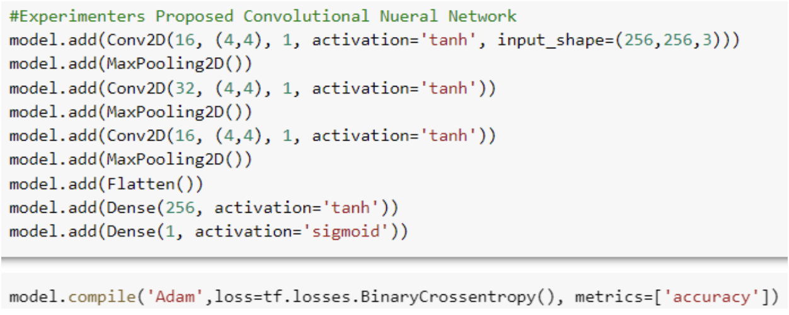
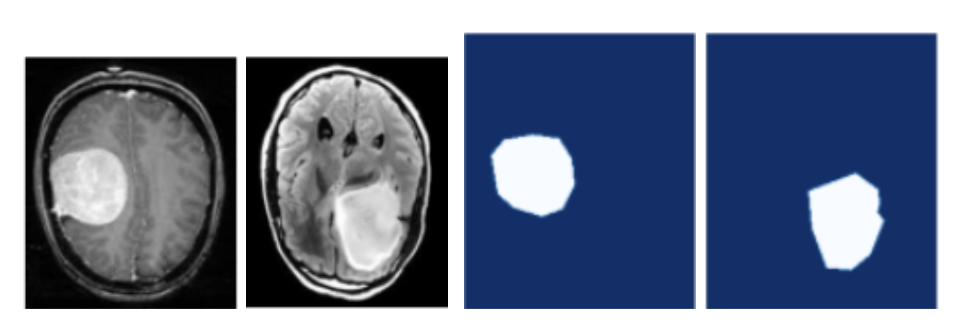
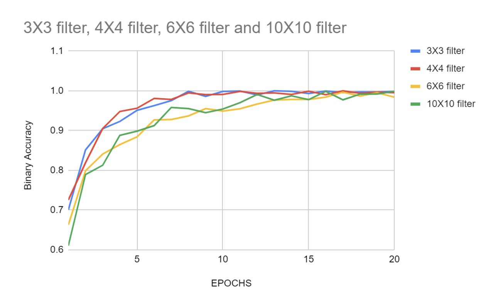
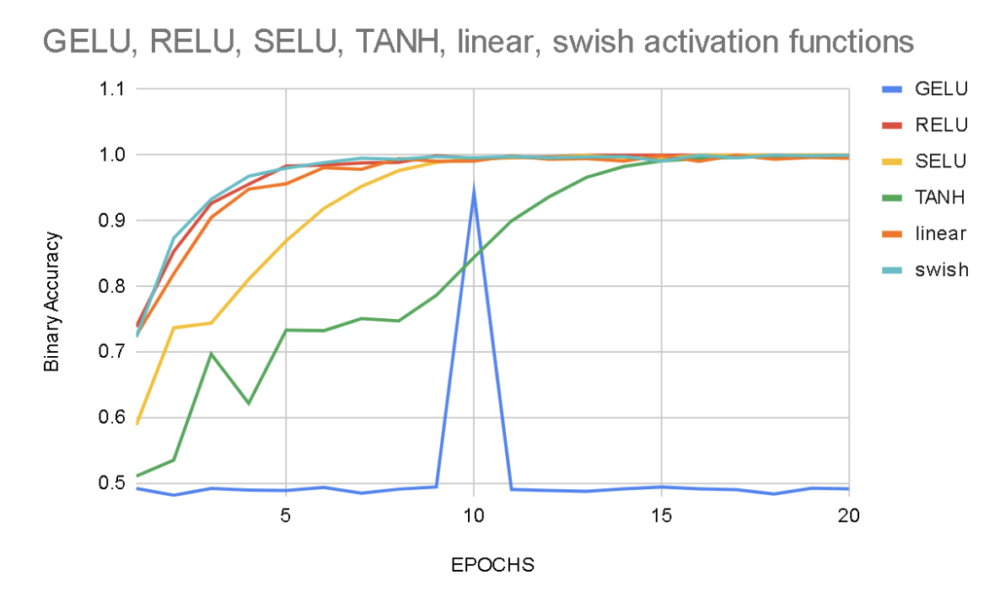
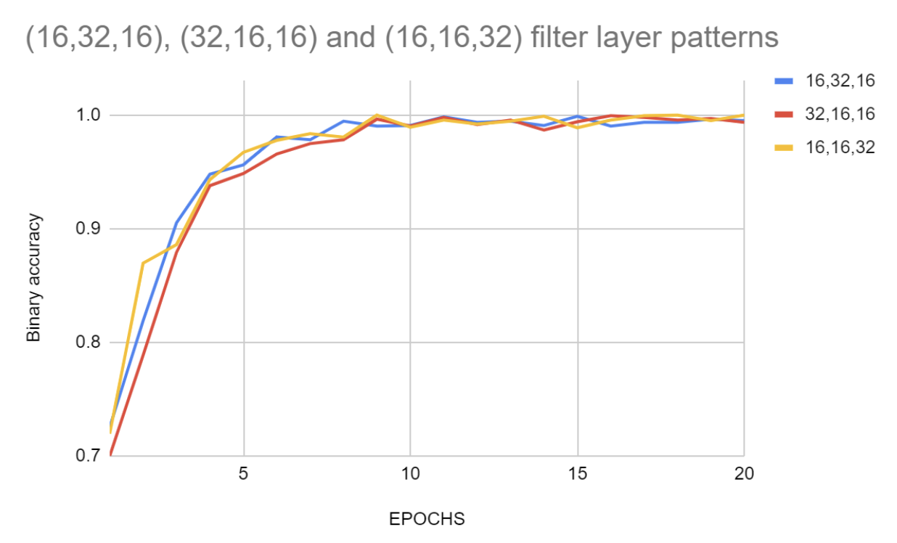
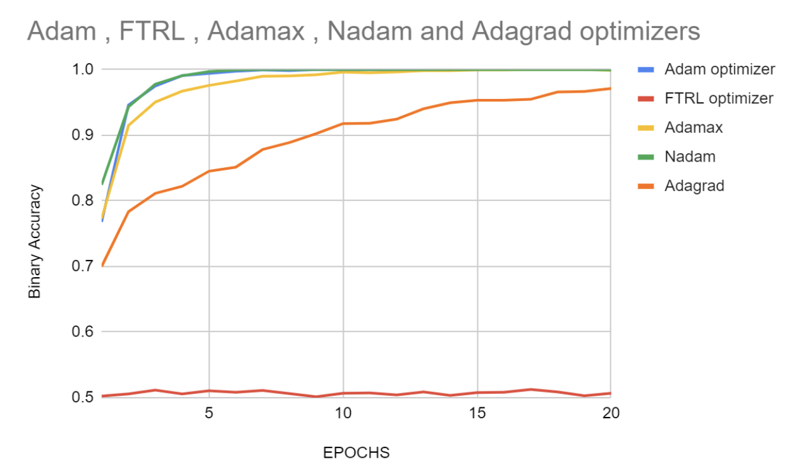
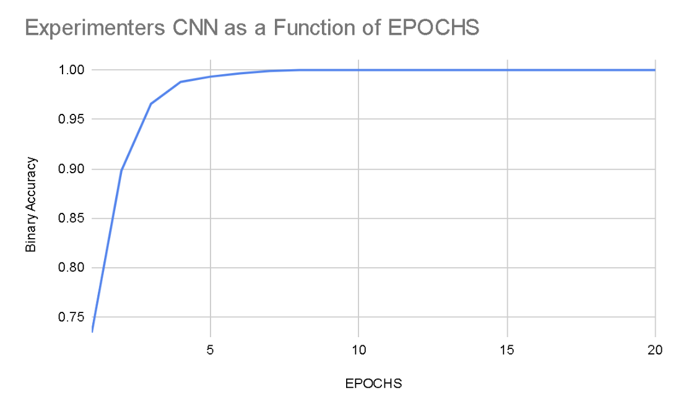
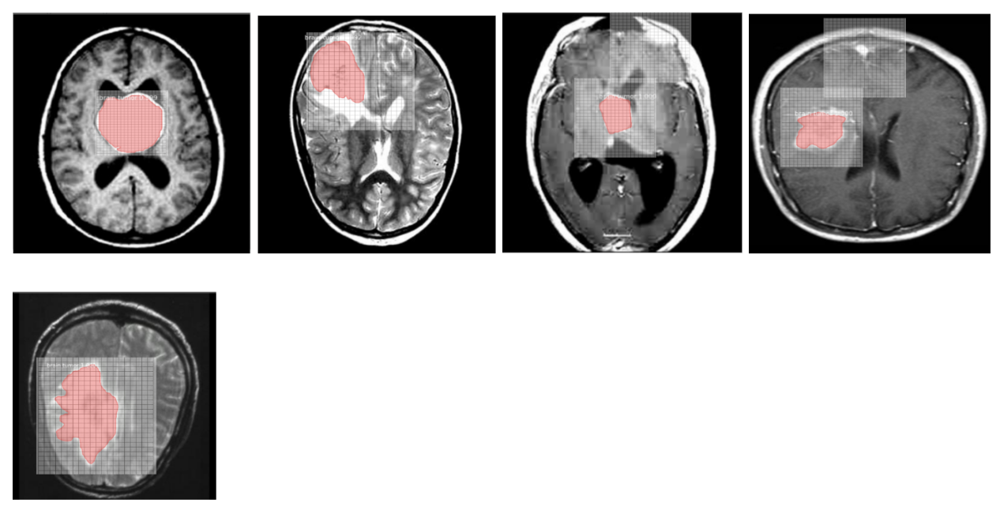

# 🧠 Optimal CNN Architecture for Brain Tumor Classification and Segmentation

A convolutional neural network system optimized to classify malignant vs. non-tumorous brain MRI scans and segment tumor boundaries — built to assist radiologists in reducing misdiagnosis through Computer Aided Diagnosis (CAD).

> **Author:** Akhilesh Kanmanthreddy  
> **School:** Saginaw Arts and Sciences Academy  
> **Competition:** Science Fair 2023

---

## 📋 Table of Contents

- [Overview](#overview)
- [How It Works](#how-it-works)
- [What Was Optimized](#what-was-optimized)
- [Results](#results)
- [Installation](#installation)
- [Usage](#usage)
- [Dataset](#dataset)
- [Metrics](#metrics)
- [Future Work](#future-work)

---

## Overview

Radiologists review 30–60 MRIs per patient, making human error in diagnosis a real risk. This project explores how to build the most accurate possible CNN for detecting malignant brain tumors from MRI scans by systematically optimizing every major architectural component.

The project had two phases:
- **Phase I — Classification:** Find the optimal CNN architecture (filter dimensions, layer patterns, activation functions, optimizers) to classify MRIs as malignant or benign
- **Phase II — Segmentation:** Train a Mask R-CNN to segment and outline tumor boundaries within MRI scans

The final optimized CNN achieved:
- **98.65%** average binary accuracy across 3 trials
- **98.6%** average recall
- Models tested during optimization reached up to **99.31%** accuracy

---

## How It Works

### Phase I — Classification

Each architectural component was tested independently to find the best-performing value, then combined into a final optimized model.


*The experimenter's proposed 9-layer CNN architecture using 4x4 filters, (16,32,16) pattern, Tanh activation, and Adam optimizer.*

The CNN architecture consists of:
- 3 convolutional layers (each followed by a max pooling layer)
- 1 flatten layer
- 2 dense layers
- Binary output (malignant / non-tumorous)

Each model was trained on **20 epochs** of training data and evaluated on a held-out test set.

### Phase II — Segmentation


*Left: Raw MRI scan. Right: Tumor segmented by the Mask R-CNN model (shown in red).*

- 40 brain tumor MRIs were manually segmented using **MakeSense.ai**
- A pre-built **Mask R-CNN** architecture was trained on the segmented images for 5 epochs of 500 steps
- The trained model was tested on 5 new MRI scans
- A **grid test** was used to measure segmentation accuracy — counting how many grid squares over the tumor the model correctly detected

---

## What Was Optimized

### Filter Dimensions
Four filter sizes were tested to find which best captures tumor features.


*Binary accuracy as a function of training epochs for 3x3, 4x4, 6x6, and 10x10 pixel filters.*

| Filter Size | Binary Accuracy | Recall |
|---|---|---|
| 3 x 3 | 97.92% | 98.04% |
| **4 x 4** | **98.61%** | **98.05%** |
| 6 x 6 | 91.32% | 85.43% |
| 10 x 10 | 94.79% | 96.97% |

### Activation Functions
Six activation functions were compared across identical CNN architectures.


*Binary accuracy over epochs for RELU, SELU, GELU, Tanh, Linear, and Swish.*

| Activation | Binary Accuracy | Recall |
|---|---|---|
| GELU | 52.43% | 70.00% |
| RELU | 96.88% | 95.21% |
| SELU | 98.26% | 97.37% |
| **Tanh** | **98.96%** | **98.76%** |
| Linear | 98.61% | 98.05% |
| Swish | 93.75% | 87.68% |

### Filter Layer Patterns
Three different patterns for the number of filters per convolutional layer were tested.


*Binary accuracy over epochs for (16,32,16), (32,16,16), and (16,16,32) filter patterns.*

| Pattern | Binary Accuracy | Recall |
|---|---|---|
| **(16, 32, 16)** | **98.61%** | **98.05%** |
| (32, 16, 16) | 96.53% | 96.58% |
| (16, 16, 32) | 97.92% | 98.56% |

### Optimizers
Five optimizers were tested to find which best trains the CNN.


*Binary accuracy over epochs for Adam, Ftrl, Adamax, Nadam, and Adagrad.*

| Optimizer | Binary Accuracy | Recall |
|---|---|---|
| **Adam** | **99.31%** | **99.35%** |
| Ftrl | 46.53% | 100% |
| Adamax | 96.88% | 95.21% |
| Nadam | 54.86% | 104.17%* |
| Adagrad | 92.36% | 95.77% |

*\*Recall > 1 indicates a metric calculation anomaly*

---

## Results

### Final Optimized CNN Performance

The final model combined the best values from each test: **4x4 filters, (16,32,16) pattern, Tanh activation, Adam optimizer.**


*Binary accuracy as a function of epochs for the experimenter's final CNN.*

| Trial | Binary Accuracy | Recall | Parameters |
|---|---|---|---|
| 1 | 98.61% | 98.56% | 3,462,465 |
| 2 | 98.46% | 98.59% | 3,462,465 |
| 3 | 98.89% | 98.65% | 3,462,465 |
| **Average** | **98.65%** | **98.60%** | |

### Segmentation Performance (Grid Test)


*Brain tumors segmented by the Mask R-CNN model (highlighted in red with grid overlay).*

| Trial | Detected Grids | Undetected Grids | Accuracy |
|---|---|---|---|
| 1 | 337 | 40 | 89.4% |
| 2 | 144 | 28 | 83.7% |
| 3 | 105 | 37 | 73.9% |
| 4 | 76 | 67 | 53.1% |
| 5 | 115 | 79 | 59.3% |
| **Average** | | | **71.88%** |

The model performed well on large, clearly defined tumors but struggled with smaller or scattered tumor segments.

---

## Installation

```bash
# Clone the repository
git clone https://github.com/<your-username>/brain-tumor-cnn.git
cd brain-tumor-cnn

# Install dependencies
pip install tensorflow opencv-python matplotlib numpy
```

**External tools required:**
- [MakeSense.ai](https://www.makesense.ai/) — for manual tumor segmentation (generating training data)

---

## Usage

1. **Classification**
   - Open the classification notebook in Google Colab
   - Mount your Google Drive and point to the dataset directory
   - Run each phase (filter dimensions → activation → layer pattern → optimizer → final model)

2. **Segmentation**
   - Open the segmentation notebook
   - Load the pre-trained Mask R-CNN weights
   - Pass MRI images through the model to generate tumor outlines

📓 **Classification Notebook:** [Google Colab Link](https://colab.research.google.com/drive/1qhZxzpyNSkPilj_Eb5S4wKFilrGJlK5c)  
📓 **Segmentation Notebook:** [Google Colab Link](https://colab.research.google.com/drive/1FSvSpI3YY8di3mN3_aJj1dFRn4xe5uXk)

---

## Dataset

MRI data sourced from the **Kaggle Brain Tumor Detection Dataset**:  
🔗 https://www.kaggle.com/datasets/ahmedhamada0/brain-tumor-detection


*Dataset split: 70% training (2100), 20% validation (600), 10% test (300) across 3000 total MRIs.*

| Total MRIs | Malignant | Benign | Train | Validation | Test |
|---|---|---|---|---|---|
| 3,000 | 1,500 | 1,500 | 70% | 20% | 10% |

---

## Metrics

| Metric | Description | Goal |
|---|---|---|
| **Binary Accuracy** | % of MRIs correctly classified as malignant or benign | 100% |
| **Recall** | % of actual malignant tumors correctly identified (minimizes false negatives) | Maximize |
| **Grid Test Accuracy** | % of tumor grid squares correctly segmented by Mask R-CNN | ≥ 95% |

---

## Key Findings

- Individually optimizing each CNN component does **not** guarantee the combined model will outperform individual experiments — the Adam optimizer alone hit 99.31%, while the fully combined model averaged 98.65%
- The steep early learning curve of the final model (visible in Figure 10) suggests the learning rate may have been too high, causing the model to converge too quickly
- The segmentation model reliably outlines **large tumors** but misses smaller scattered regions, suggesting more diverse training data is needed

---

## Future Work

- **More training data** — expanding beyond 3,000 MRIs and including more diverse tumor types and sizes
- **Learning rate tuning** — a lower learning rate may prevent premature convergence and improve final accuracy
- **Additional optimization strategies** — exploring techniques like dropout, batch normalization, and data augmentation
- **Improved segmentation** — training on a larger and more varied segmentation dataset to handle small and irregular tumors
- **Clinical deployment** — integrating the model into a radiologist workflow as a confirmation tool alongside professional diagnosis

---

## References

- Kaggle Dataset: https://www.kaggle.com/datasets/ahmedhamada0/brain-tumor-detection
- Classification source code: https://github.com/nicknochnack/ImageClassification
- Segmentation source code: https://colab.research.google.com/github/pysource7/utilities/blob/master/Train_Mask_RCNN_(DEMO).ipynb
- Activation functions reference: https://www.v7labs.com/blog/neural-networks-activation-functions
